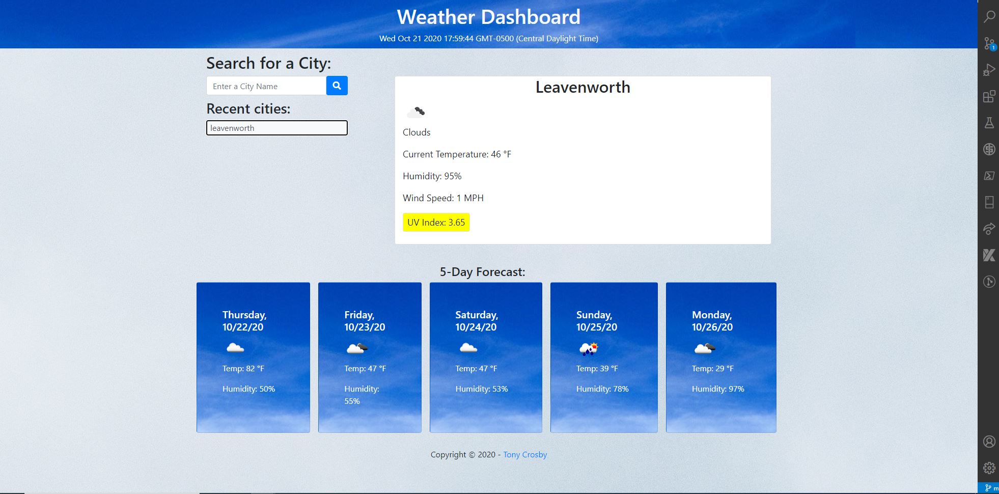

# Picture of the Weather Dashboard
<a href="http://tonycrosby.net/06_weather_dashboard/" target="_blank"></a>

> This is a weather dashboard used to find the weather in any City, When searched you can click on any recent city you searched for and it will display the weather in that city. This weather dashboard Displays the Current weather Forecast from The Type of Weather, Temperature, Humidity, Wind Speed and UVI Index. Also when searched a 5-Day forecast will appear including the day and date, Temperature and Humidity! On the top of the screen will Display the current time and the current day.

### > To get to the Repository <a target="_blank" href="https://github.com/tonycrosby-tech/06_weather_dashboard"> Click this link </a>

### > To get to the Deployed Website <a target="_blank" href="https://tonycrosby-tech.github.io/06_weather_dashboard/"> Click this link </a>

#

# Technologies I used Include

> HTML, Javascript, OpenWeatherAPI, Bootstrap CSS, JQuery

# Direction for future development

> I would like to implement more features including clearing history, and getting the current location.

## User Story

```
AS A traveler
I WANT to see the weather outlook for multiple cities
SO THAT I can plan a trip accordingly
```

# Acceptance Criteria

```
GIVEN a weather dashboard with form inputs
WHEN I search for a city
THEN I am presented with current and future conditions for that city and that city is added to the search history
WHEN I view current weather conditions for that city
THEN I am presented with the city name, the date, an icon representation of weather conditions, the temperature, the humidity, the wind speed, and the UV index
WHEN I view the UV index
THEN I am presented with a color that indicates whether the conditions are favorable, moderate, or severe
WHEN I view future weather conditions for that city
THEN I am presented with a 5-day forecast that displays the date, an icon representation of weather conditions, the temperature, and the humidity
WHEN I click on a city in the search history
THEN I am again presented with current and future conditions for that city
WHEN I open the weather dashboard
THEN I am presented with the last searched city forecast
```

## Thanks for checking out my Weather Dashboard

### Tony Crosby
